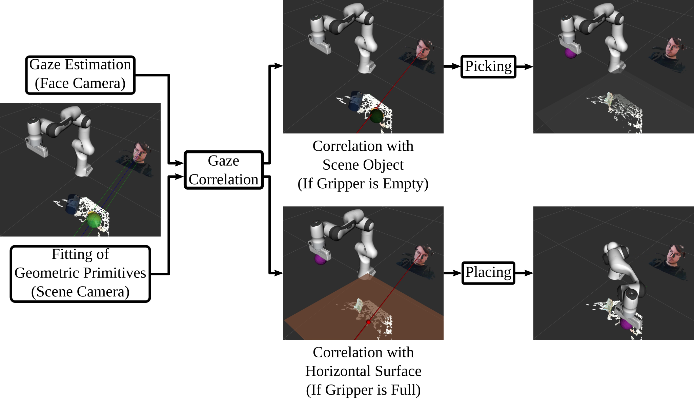

# Eye Controlled Assistive Robotic Device (ECARD)
 

This repository implements a semi-autonomous control strategy of an assistive robotic manipulator that utilises eye gaze to acquire information about the intention of the user. A demonstration of a simple pick and place task can be seen below.


## Description

The system is based around the following pipeline, in which several subcomponents are employed.


Many of these components were initially developed for this project as separate packages, but all of them can work as standalone nodes. You can find more information in their respective repositories.
- [RGB-D Gaze](https://github.com/AndrejOrsula/rgbd_gaze)
- [Geometric Primitive Fitting](https://github.com/AndrejOrsula/gpf)
- [Gaze Correlation](https://github.com/AndrejOrsula/gaze_correlation)

Manipulation was implemented with [MoveIt2](https://github.com/ros-planning/moveit2), however, all tests were performed in virtual environment (mainly due to immature state of ROS 2 controllers as of May 2020).


## Installation

First, clone this repository into your favourite workspace. Furthermore, clone all other repositories listed under [ecard.repos](ecard.repos).
```bash
mkdir -p <awesome_ws>/src && cd <awesome_ws>/src
git clone https://github.com/AndrejOrsula/ecard
vcs import < ./ecard/ecard.repos
```

### Dependencies

- [OpenFace 2](https://github.com/TadasBaltrusaitis/OpenFace/wiki/Unix-Installation) (tested with 2.2.0) - follow [this sript](https://github.com/AndrejOrsula/ros2_openface/blob/master/scripts/install_ros2_openface.bash) if in doubt
- [librealsense](https://github.com/IntelRealSense/librealsense/blob/master/doc/distribution_linux.md) (tested with 2.34.0)

All other dependencies can be installed via `rosdep`.
```bash
cd <awesome_ws>/src
rosdep install --from-paths . --ignore-src --rosdistro ${ROS_DISTRO}
```

### Building

Build all packages with [colcon](https://colcon.readthedocs.io/en/released/user/installation.html).
```bash
cd <awesome_ws>
colcon build --symlink-install --cmake-args "-DCMAKE_BUILD_TYPE=Release"
```

## Usage

First, source the ROS 2 global installation (if not done before).
```bash
source /opt/ros/eloquent/setup.bash
```

Then source the ROS 2 workspace overlay (if not done before).
```bash
source <awesome_ws>/install/local_setup.bash
```

Edit RealSense [face camera config](ecard/config/rs/rs_face_d415.yaml) and [scene camera config](ecard/config/rs/rs_scene_d435.yaml) to the specific serials.

Finally, you can run the personal calibration and the stack itself.
```bash
# Personal calibration
ros2 launch ecard calibrate_eyeball.launch.py
ros2 launch ecard calibrate_kappa.launch.py
# Stack
ros2 launch ecard ecard.launch.py
```

## License
This project is licensed under [BSD 3-Clause License](LICENSE).
